# TrainerPro — Markenbriefing für Logo-Erstellung

Dieses Dokument fasst alles zusammen, was eine externe KI (oder ein:e Designer:in) braucht,
um ein eigenständiges Logo für **TrainerPro** zu entwickeln — ohne weiteren Kontext aus der
Entwicklung zu benötigen. Es enthält die App-Beschreibung, die bestehende Design-Sprache
(Farben, Typografie, Formensprache) sowie Screenshots aller Bereiche der App.

## 1. Was ist TrainerPro?

TrainerPro ist eine Web-App für **Tischtennis-Trainer:innen** im Vereins- und Freizeitsport.
Sie hilft dabei, Trainingspläne und Übungen zu verwalten — von der Übungsdatenbank über die
Planzusammenstellung bis zur Trainingsdurchführung mit Timer und Aufschlagtraining-Tracking.

**Kernfunktionen:**

- **Trainingspläne** — Pläne aus einem Übungspool zusammenstellen, mit Zielgruppe, Termin und
  Dauer; überfällige Pläne werden hervorgehoben.
- **Übungsdatenbank** — eigene Tischtennis-Übungen anlegen (Name, Beschreibung, Ziel, Dauer,
  Schwierigkeitsgrad).
- **Trainingsdurchführung** — nummerierte Übungsliste mit Countdown-Timer pro Übung.
- **Aufschlagtraining** — Live-Tracking einzelner Aufschläge (gut/schlecht) gegen ein vorher
  festgelegtes Ziel (Länge + Platzierung), mit Liniendiagramm der Erfolgsquote am Ende.
- **Statistiken** — Kennzahlen, Schwierigkeitsgrad-Verteilung, meistgenutzte Übungen.

**Zielgruppe:** Ehrenamtliche und hauptberufliche Tischtennis-Trainer:innen — von der
Jugendabteilung bis zum Wettkampfteam. Die App soll seriös und kompetent wirken (ein
professionelles Werkzeug, kein Spiel), aber nicht kalt oder unpersönlich.

**Sportbezug:** Die App ist fest auf **Tischtennis** 🏓 ausgerichtet (keine andere Sportart
wählbar).

## 2. Aktuelles Icon (Platzhalter — kein richtiges Logo)

Es existiert aktuell **kein individuelles Logo**, nur zwei uneinheitliche Platzhalter:

- **In der App** (Sidebar, mobile Kopfzeile, Anmeldung/Registrierung): ein generisches
  „Target"-Icon (Zielscheibe, aus der Icon-Bibliothek [lucide-react](https://lucide.dev)) in
  einem abgerundeten Quadrat mit blauem Verlauf.
- **Favicon** (`public/favicon.svg`): eine abstrakte Doppel-Schlaufen-Form in Blau — sieht
  einer stilisierten „S"-Form bzw. zwei verbundenen Kreisbögen ähnlich, hat aber keinen klaren
  Bezug zu Tischtennis oder zum Namen TrainerPro.

Beide Platzhalter sind generisch und könnten für jede beliebige Sport- oder Produktivitäts-App
stehen. Genau das soll das neue Logo ändern: eine **unverwechselbare, auf Tischtennis und
TrainerPro zugeschnittene Bildmarke**.

## 3. Bestehende Design-Sprache

Das neue Logo sollte sich in dieses bestehende visuelle System einfügen (siehe Screenshots
unten), nicht zwingend jedes Element wörtlich aufgreifen, aber farblich und im Charakter dazu
passen.

### Farbpalette

| Rolle | Hex | Verwendung |
|---|---|---|
| Primary | `#3b82f6` | Haupt-Markenfarbe, Buttons, aktive Zustände |
| Primary Dark | `#1d4ed8` | Verlauf-Partner zu Primary, dunklere Flächen |
| Primary Soft | `#172a4d` | Sanfte Hintergrundflächen für Badges |
| Accent | `#38bdf8` | Sekundärakzent (helles Cyan), Icons, Highlights |
| Accent Dark | `#0369a1` | Verlauf-Partner zu Accent |
| Sun | `#7dd3fc` | Dritter Akzent (helles Himmelblau), sparsam eingesetzt |
| Background | `#0a0f1c` | Seiten-Hintergrund (fast schwarzes Dunkelblau) |
| Surface | `#16223c` | Kartenflächen |
| Border | `#2d4269` | Rahmenlinien |
| Ink (Text) | `#eef2fb` | Haupttext (auf dunklem Grund) |
| Danger | `#f87171` | Warn-/Löschfarbe (Korallrot), nicht markenprägend |

**Wichtig:** Die App ist bewusst **ausschließlich in Blautönen** gehalten — kein Grün, kein
Lila, kein Rot als Markenfarbe (Rot ist nur für Lösch-/Fehlerzustände reserviert). Das Logo
sollte diese Blau-Beschränkung respektieren.

### Typografie

- **Display/Überschriften:** [Baloo 2](https://fonts.google.com/specimen/Baloo+2) — eine
  runde, kräftige, freundliche Schrift mit hohem Charakter.
- **Fließtext/UI:** [Plus Jakarta Sans](https://fonts.google.com/specimen/Plus+Jakarta+Sans) —
  eine klare, moderne Grotesk.

Falls das Logo einen Schriftzug enthält, passt eine runde, kräftige Anmutung (ähnlich Baloo 2)
besser als eine strenge, eckige Schrift.

### Formensprache & Stimmung

- **Dunkles Theme:** fast schwarzer Hintergrund, keine hellen/weißen Flächen als Basis.
- **Stark abgerundete Ecken** überall (Karten, Buttons, Badges) — nichts ist eckig oder
  scharfkantig.
- **Sanfte, schwebende Glow-Flächen** (unscharfe, leuchtende Farbkreise) im Hintergrund vieler
  Screens — erzeugen Tiefe und eine "lebendige", nicht-statische Atmosphäre.
- **Gradient-Verläufe** (Primary → Primary Dark bzw. Accent → Accent Dark) auf Buttons, Icons
  und Illustrationen statt flacher Einzelfarben.
- **Isometrische 3D-Elemente** im Onboarding (siehe Screenshots 1–3): ein kleiner isometrischer
  Block mit drei sichtbaren Flächen in unterschiedlichen Blautönen, umgeben von schwebenden
  Icon-Badges und kleinen "Konfetti"-Punkten.
- Insgesamt: **modern, technisch-kompetent, aber warm** — kein steriles Corporate-Blau, sondern
  freundlich durch die runden Formen und Glow-Akzente.

## 4. Anforderungen an das neue Logo

- **Eigenständige Bildmarke**, die auch ohne Schriftzug „TrainerPro" funktioniert (für App-Icon,
  Favicon, Ladebildschirm) — optional zusätzlich eine Wortmarken-Variante mit Schriftzug.
- Sollte bei **sehr kleinen Größen** (Browser-Tab, App-Icon ~32–48 px) noch erkennbar und klar
  sein — keine feinen Details, die bei Skalierung verschwimmen.
- Muss auf dem **dunklen Hintergrund** (`#0a0f1c`) funktionieren; eine Variante für helle
  Flächen (z. B. App-Store-Listing) ist ein Plus.
- Farblich **innerhalb der bestehenden Blau-Palette** (siehe oben) oder zumindest damit
  harmonierend — kein Rot/Grün/Lila als Hauptfarbe.
- **Tischtennis-Bezug erwünscht**, muss aber nicht wörtlich sein (Schläger, Ball, Flugbahn sind
  denkbare Motive — siehe die isometrische Illustration im Onboarding als Inspiration), auch
  eine abstrakte Interpretation ist willkommen.
- Sollte **nicht** wie ein generisches Fitness-Studio- oder Ziel-/Bullseye-Icon wirken (genau
  das ist der aktuelle Platzhalter, den es zu ersetzen gilt).
- Format: **quadratisch nutzbar** (App-Icon/Favicon), idealerweise als Vektor (SVG) geliefert.

## 5. Screenshots aller Screens

Alle Screenshots zeigen den aktuellen Stand der App (Desktop 1440×900, zwei zusätzliche
Mobile-Ansichten am Ende zur Einordnung des responsiven Verhaltens).

### Onboarding (vor der Anmeldung)

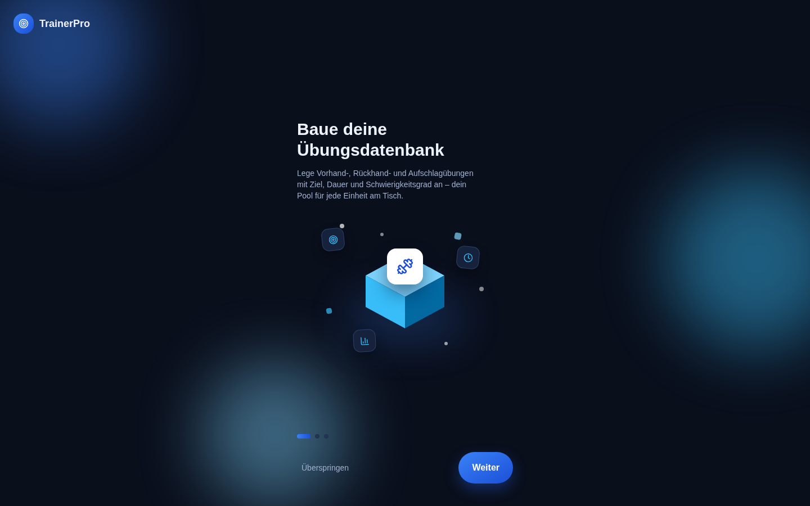
*Onboarding Schritt 1 von 3 — isometrische Illustration, linksbündiger Titel.*

*Onboarding Schritt 2 von 3.*

*Onboarding Schritt 3 von 3 — letzter Schritt mit „Registrieren"-Button.*

### Anmeldung & Registrierung

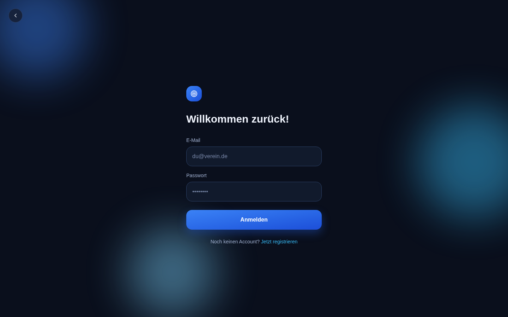
*Anmelde-Formular.*

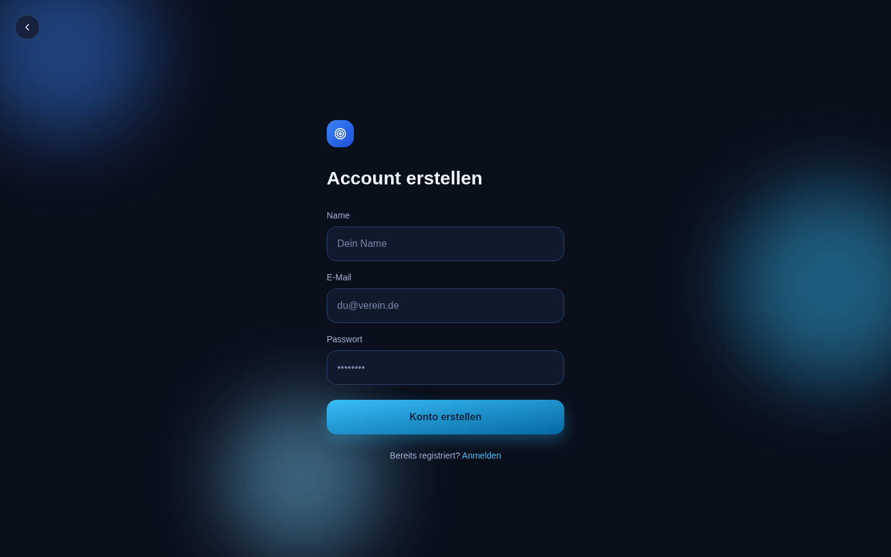
*Registrierungs-Formular.*

### Trainingspläne

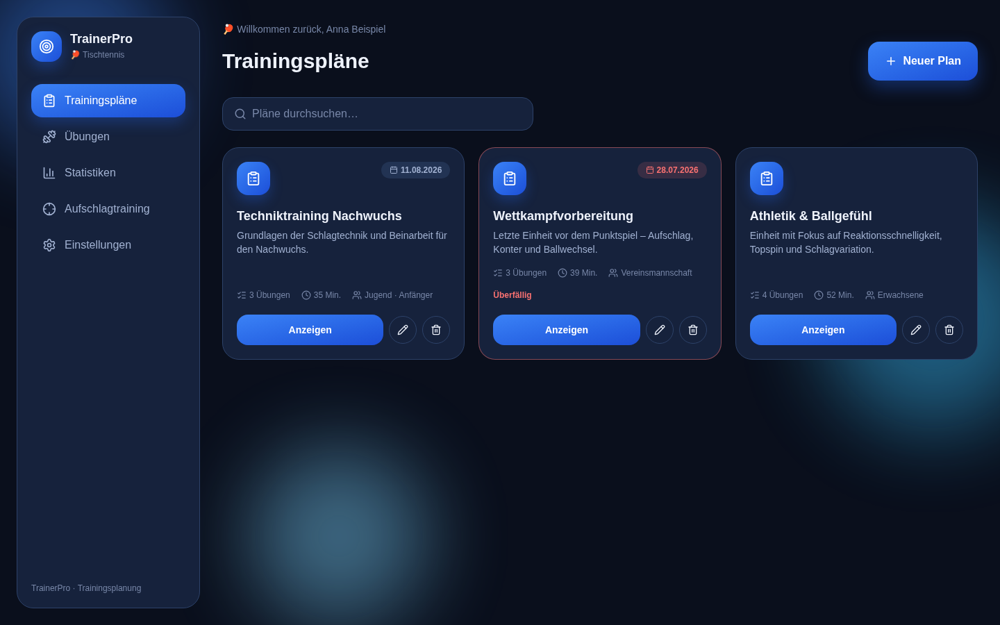
*Plan-Übersicht als Kacheln, überfällige Pläne rot markiert.*

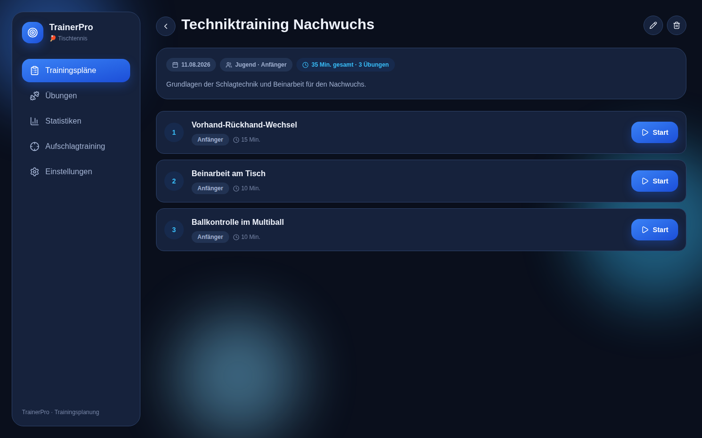
*Detailansicht eines Plans mit nummerierter Übungsliste und Start-Button je Übung.*

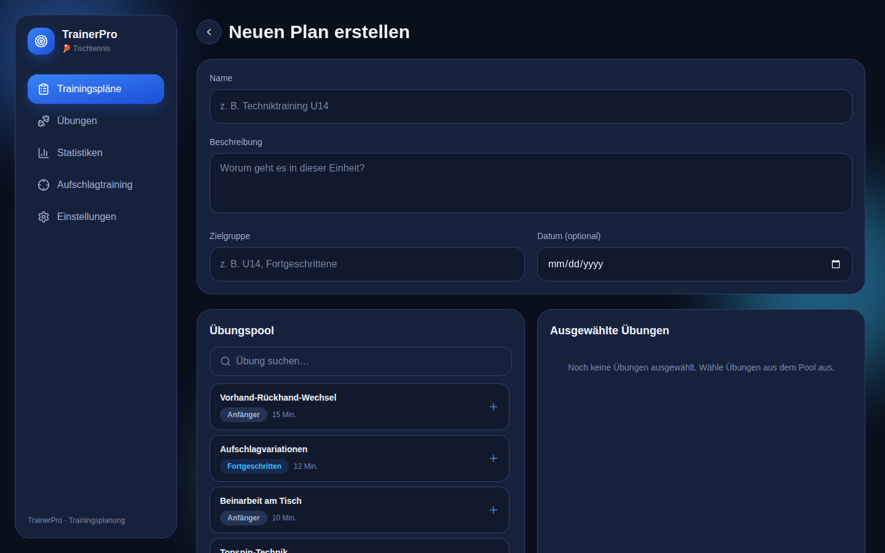
*Neuen Trainingsplan anlegen.*

### Übungen

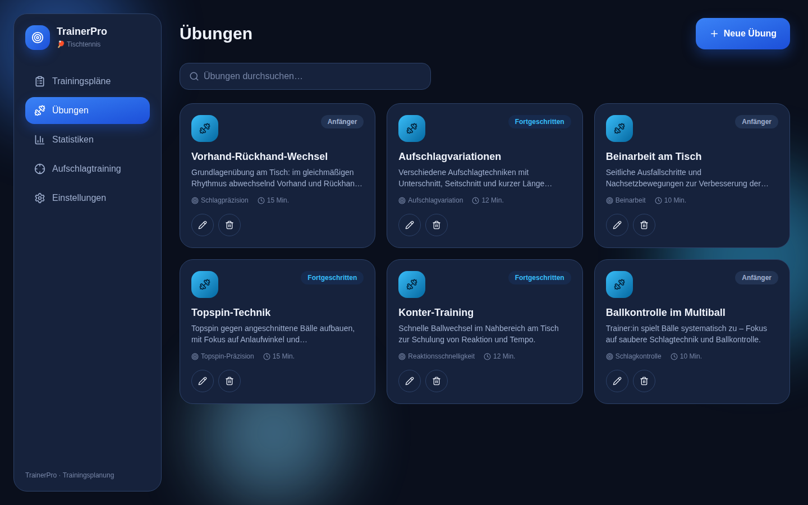
*Übersicht der eigenen Übungsdatenbank.*

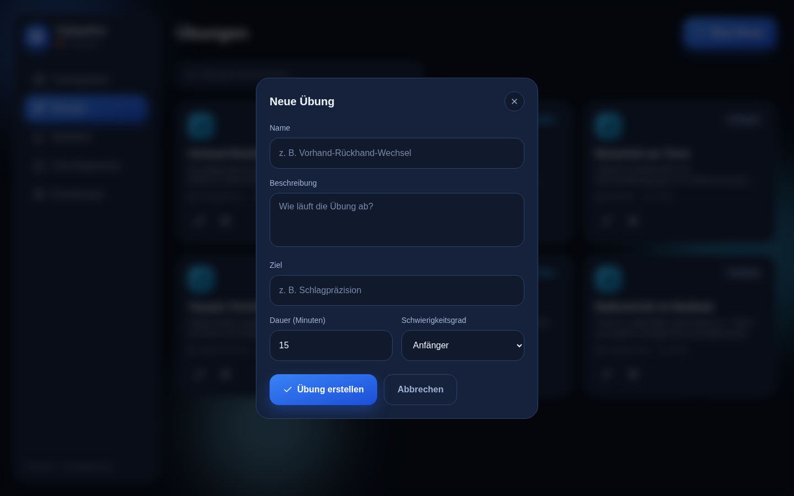
*Neue Übung anlegen (Modal).*

### Statistiken

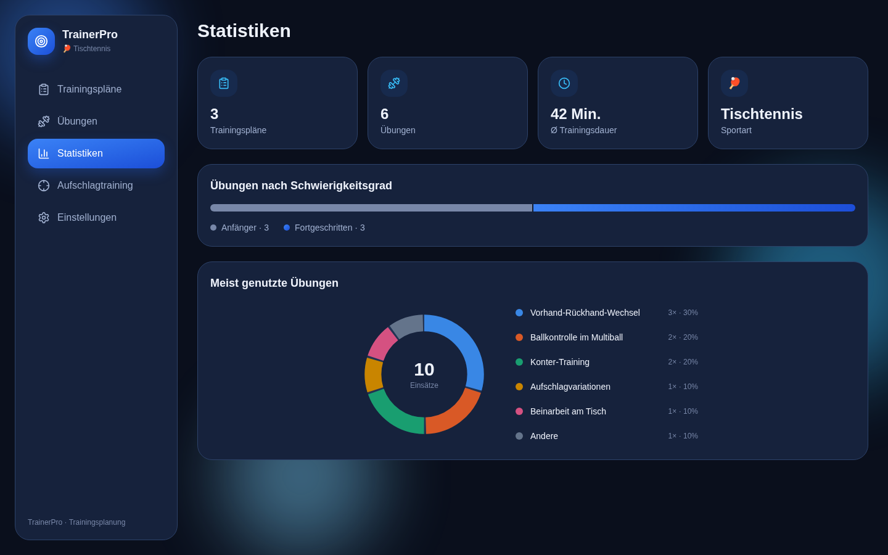
*Kennzahlen, Schwierigkeitsgrad-Verteilung, Donut-Chart der meistgenutzten Übungen.*

### Einstellungen

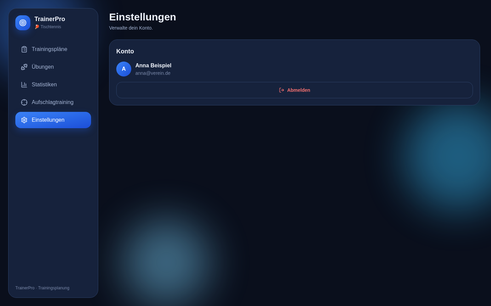
*Konto-Verwaltung.*

### Aufschlagtraining

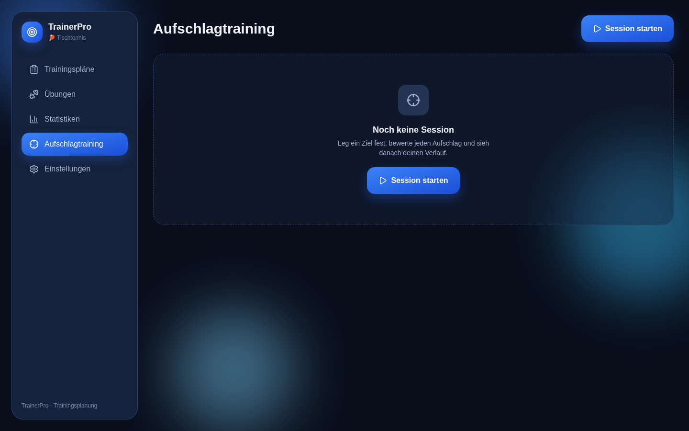
*Übersicht mit Möglichkeit, eine neue Session zu starten.*

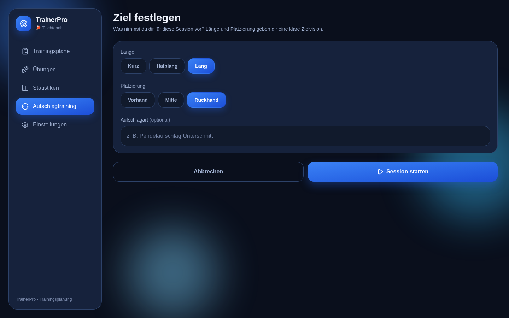
*Vor der Session: Länge und Platzierung als Ziel festlegen.*

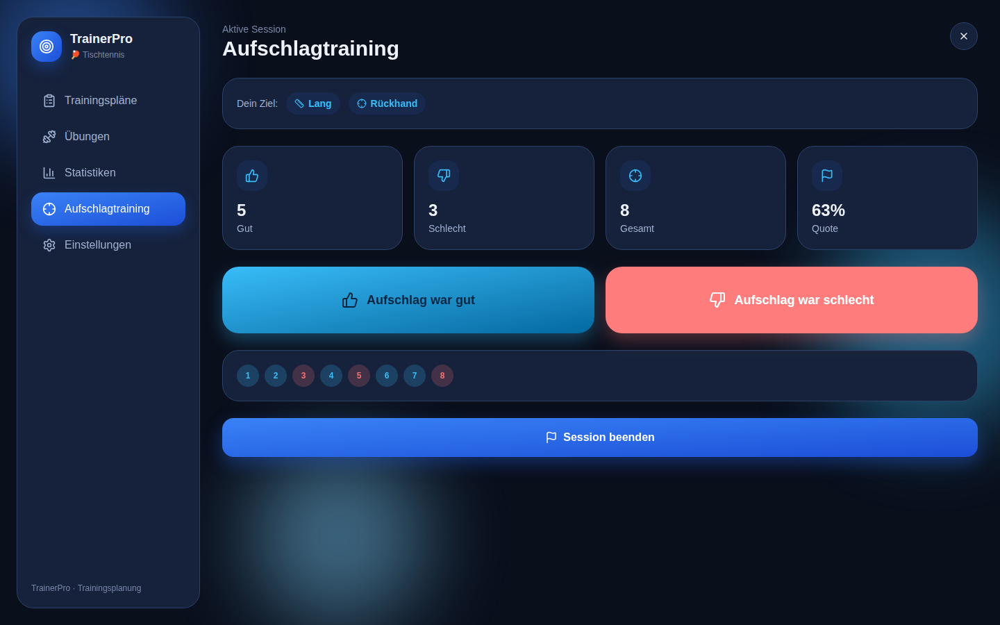
*Während der Session: jeder Aufschlag wird live als gut/schlecht bewertet.*

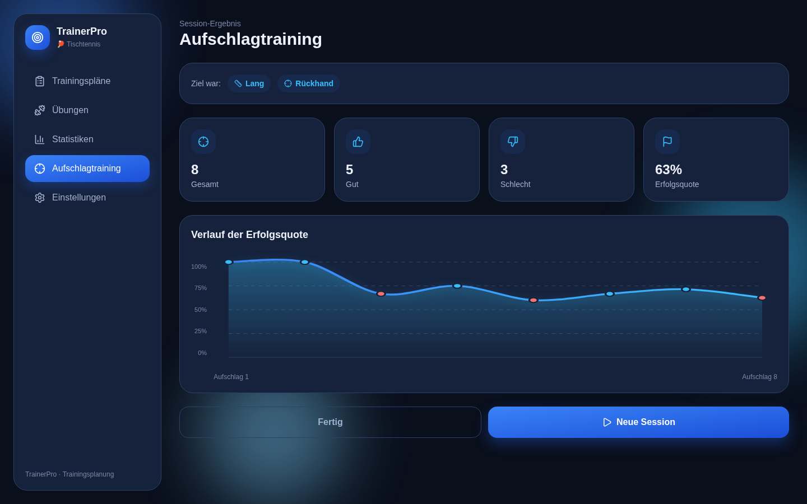
*Nach der Session: Liniendiagramm der Erfolgsquote im Verlauf.*

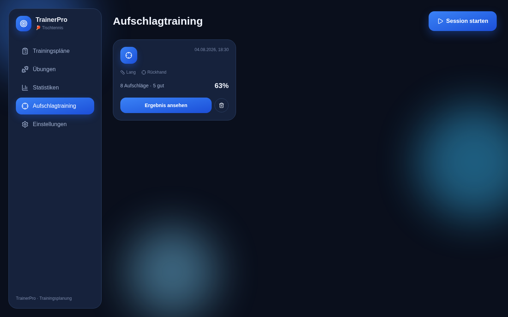
*Übersicht mit gespeicherter Session-Historie.*

### Mobile-Ansicht (zur Einordnung)

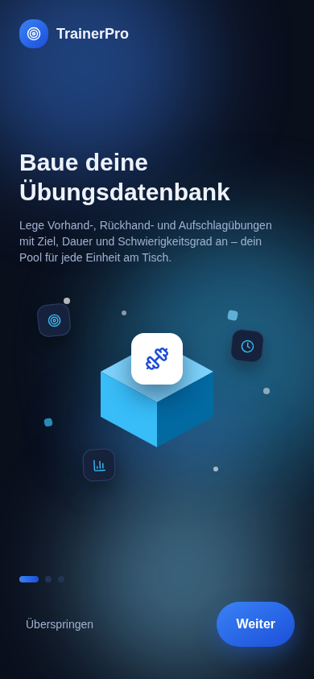
*Onboarding auf einem Mobilgerät (390 px Breite).*

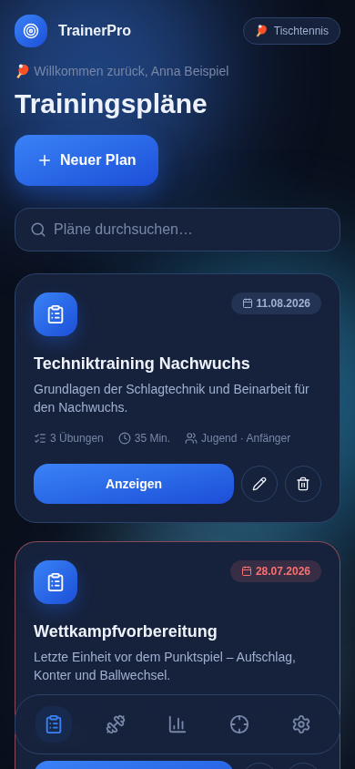
*Plan-Übersicht auf einem Mobilgerät mit Bottom-Navigation.*
